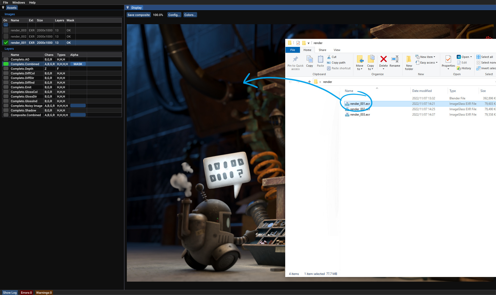

# xComp

## Overview

**xComp** is an image viewer capable of building composites of a stack of images with transparent regions.

This tool was built to visualize region updates of a render on top of previous renders, in real-time. Images found in a chosen folder to scan for, are quickly composited with alpha blending in a stack. OpenColorIO transformations are optionally added to the composite image, which can be saved out as a PNG.

Note that because ordering of compositing is dictated by file name, images should be titled by a timestamp, or with a sequential number.

**xComp** is also useful to quickly view EXR images and their various layers.

## Quick Start

### Loading images into xComp

There are three possible ways to load an image or a folder of images into **xComp**.

### 1. Drag & Drop

Drag and drop your first render into **xComp**.
Notice that it may take a few seconds to load, if there are serveral images in the folder.

{:width="50%"}

### 2. Set the path in the config panel

Click on the *Config...* button in the *Display* panel, or select *File->Configuration* from the menu, then paste the path of the folder with your images into the ***Scan Folder*** edit box.

### 3. Manually edit the config file

If you are on Windows, manually edit `mt_compare_config.json` found inside `%APPDATA%\Xcomp\profile_default`.

### Correctly naming the images from the renderer

**xComp** determines the order of the layers based on the numbering of the rendered images.
For this reason, we suggest saving the renders with a numerical postfix like `_001`, `_002`, etc..

## Tips

- EXR files can be very heavy, and they use a large amount of memory, be careful.
- EXR files are usually color-managed in post-production. At the moment **xComp** supports OpenColorIO configurations that allows the user to plug-in custom OCIO files.
- Avoid using images that are directly on the desktop. There's a _known issue_ that may make the application crash in some cases.

